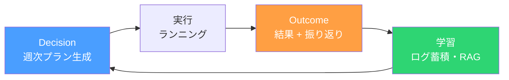
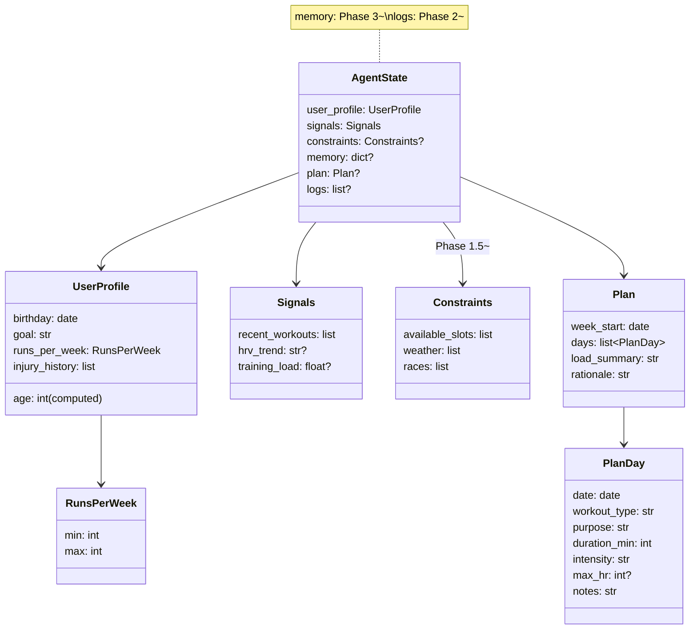
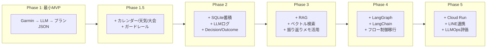
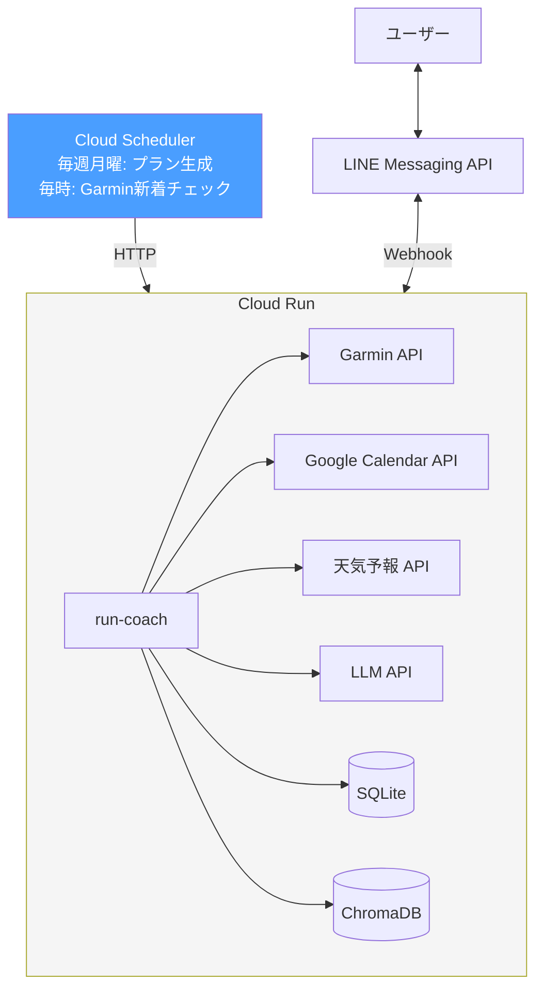

# run-coach

ランニング用パーソナルトレーナーAIエージェント

## 概要

Garminのワークアウトデータ、個人スケジュール、天気予報、大会情報をもとに
トレーニングスケジュールを自動生成するAIエージェント。

## データソース

| データ | 取得方法 | 備考 |
|--|--|--|
| ワークアウト履歴・体調 | `python-garminconnect` | 心拍数, ペース, HRV, VO2Max等 |
| 個人スケジュール | `icalBuddy` (CLI) / Google Calendar API | ローカル: icalBuddy、Cloud Run: Google Calendar API |
| 天気予報 | OpenWeatherMap API等 | 無料枠で十分 |
| 大会情報 | Garmin Connect API (`garth`直接) | `/calendar-service/event/{id}` で取得。設定ファイルはフォールバック |
| トレーニング生成 | LLM API | システムプロンプトにコーチ知識を埋め込み |

## アーキテクチャ

### 全体フロー

```mermaid
flowchart TB
    subgraph データソース
        G[Garmin Connect<br>ワークアウト / 体調 / 大会]
        C[カレンダー<br>icalBuddy / Google]
        W[天気予報 API]
    end

    subgraph エージェント
        F[データ収集・整形]
        GL[ガードレール<br>コーチングルール]
        LLM[LLM<br>OpenAI / Claude]
        RAG[RAG<br>ChromaDB]
    end

    subgraph 出力
        JSON[週次プラン JSON]
        MD[Markdown表示]
        LINE[LINE通知・対話]
    end

    G --> F
    C --> F
    W --> F
    F --> LLM
    GL --> LLM
    RAG -.->|Phase 3| LLM
    LLM --> JSON
    JSON --> MD
    JSON --> LINE
```



### Decision / Outcome サイクル



### Stateスキーマの構造



### Phase別の成長



### 本番構成 (Phase 5: Cloud Run)



## フェーズ計画

各Phaseの詳細（フロー図・タスク・State定義）は個別ファイルを参照。

| Phase | 概要 | 詳細 |
|--|--|--|
| **1** | 最小MVP: Garmin + LLM → プランJSON | [docs/phase1-mvp.md](docs/phase1-mvp.md) |
| **1.5** | カレンダー/天気/大会 + ガードレール | [docs/phase1.5-datasources.md](docs/phase1.5-datasources.md) |
| **2** | SQLite蓄積 + LLMログ + Decision/Outcome | [docs/phase2-data-logging.md](docs/phase2-data-logging.md) |
| **3** | RAG: ベクトル検索で振り返り・知識活用 | [docs/phase3-rag.md](docs/phase3-rag.md) |
| **4** | LangGraph/LangChainで書き換え | [docs/phase4-langgraph.md](docs/phase4-langgraph.md) |
| **5** | Cloud Run + LINE + LLMOps | [docs/phase5-production.md](docs/phase5-production.md) |

## Stateスキーマ（Pydantic）

Phase 1から型を定義し、Phaseが進むごとにフィールドを追加していく。

```python
from pydantic import BaseModel

class RunsPerWeek(BaseModel):
    min: int = Field(ge=1, le=7)
    max: int = Field(ge=1, le=7)

class UserProfile(BaseModel):
    birthday: date
    goal: str                    # 例: "サブ4", "完走"
    runs_per_week: RunsPerWeek   # 走れる頻度（min〜max）
    injury_history: list[str]    # 怪我歴

    @computed_field
    @property
    def age(self) -> int: ...    # birthdayから自動計算

class Signals(BaseModel):        # 直近7-14日のまとめ
    recent_workouts: list[WorkoutSummary]
    hrv_trend: str | None        # "improving" / "declining" / "stable"
    training_load: str | None
    race_predictions: dict[str, str] | None

class Constraints(BaseModel):    # Phase 1.5で追加
    available_slots: list[dict]  # カレンダーの空き枠
    weather: list[dict]          # 天気予報
    races: list[dict]            # 大会情報

class PlanDay(BaseModel):
    date: date
    workout_type: str            # easy_run, tempo, intervals, long_run, rest, cross_training
    purpose: str                 # 目的（疲労抜き、心肺強化 等）
    duration_min: int
    intensity: str               # low, moderate, high
    max_hr: int | None           # 心拍上限（LLMが年齢・目的から決定。restはnull）
    notes: str

class Plan(BaseModel):           # LLM出力（JSON）
    week_start: date
    days: list[PlanDay]
    load_summary: str
    rationale: str               # なぜこのプランか（3-5行）

class AgentState(BaseModel):
    user_profile: UserProfile
    signals: Signals
    constraints: Constraints | None = None  # Phase 1.5で追加
    memory: dict | None = None              # Phase 3で追加
    plan: Plan | None = None
    logs: list[dict] | None = None          # Phase 2で追加
```

## 週次プランの出力形式

LLMの出力は**構造化JSON**を主、表示はMarkdownを従とする。

```json
{
  "week_start": "2026-03-09",
  "days": [
    {"date": "2026-03-09", "workout_type": "easy_run", "purpose": "疲労抜き", "duration_min": 40, "intensity": "low", "max_hr": 140, "notes": ""},
    {"date": "2026-03-11", "workout_type": "tempo", "purpose": "閾値向上", "duration_min": 50, "intensity": "high", "max_hr": 165, "notes": "4:30/kmで20分"},
    {"date": "2026-03-13", "workout_type": "easy_run", "purpose": "有酸素ベース", "duration_min": 40, "intensity": "low", "max_hr": 145, "notes": ""},
    {"date": "2026-03-15", "workout_type": "long_run", "purpose": "持久力養成", "duration_min": 90, "intensity": "moderate", "max_hr": 155, "notes": "LSD 15km"}
  ],
  "load_summary": "週4回, 計36km, 高強度1回",
  "rationale": "先週のロング走で心拍が高めだったため、今週は高強度を1回に抑えテンポ走に集中。"
}
```

## コーチングルール（ガードレール）

RAG不要の固定ルール。Phase 1.5でプロンプトまたはコードに組み込む。

- 週2回以上の高強度を入れない
- ロング走の翌日は原則イージーまたは休息
- 週間走行距離の増加は前週比10%以内
- レース3週間前からテーパリング開始
- HRV低下 + 睡眠不足の場合は回復優先

## Human-in-the-loopのログ設計（Phase 2）

Decision/Outcomeの2テーブルで管理。

| テーブル | 内容 | 例 |
|--|--|--|
| **Decision** | 生成したプラン + その根拠 | 週次プランJSON + inputs_summary |
| **Outcome** | 実施結果 + 主観評価 | 完遂/変更/未実施, RPE, 痛み, コメント |

この2つを蓄積することで「エージェントが過去の判断と結果から学習する」基盤になる。

## LangGraph移行を見据えた設計方針

自前実装の段階から、後でLangGraphに載せ替えやすい構造にしておく。

- **各処理を state(AgentState) を受け取り state を返す関数にする** → そのままLangGraphのノードになる
- **ツール呼び出しをインターフェースで抽象化** → LangChainのTool形式に差し替えやすい
- **フロー制御を関数単位で分離** → グラフのエッジに置き換えるだけ

```python
def fetch_garmin(state: AgentState) -> AgentState:    # → ノード
    ...
    return state

def fetch_calendar(state: AgentState) -> AgentState:  # → ノード
    ...
    return state

def generate_plan(state: AgentState) -> AgentState:   # → ノード
    ...
    return state

# フロー制御（自前）→ 後でLangGraphのステートグラフに置き換え
def run():
    state = AgentState(...)
    state = fetch_garmin(state)
    state = fetch_calendar(state)
    state = generate_plan(state)
    return state
```

## 参考書籍の読み方メモ

「LangChainとLangGraphによるRAG・AIエージェント［実践］入門」(技術評論社)

| 章 | 優先度 | メモ |
|--|--|--|
| 2-3章 API・プロンプト基礎 | 必須 | Phase 1の基礎 |
| 4-5章 LangChain・LCEL | 必須 | LangGraph(8-9章)の前提知識 |
| 6章 Advanced RAG | 必須 | RAGの仕組み。自前実装にも必要な概念 |
| 7章 RAGの評価 | 後回しOK | 必要になったら戻る |
| 8-9章 エージェント・LangGraph | 必須 | エージェント設計の本題 |
| 10-12章 実践・デザインパターン | 必須 | Phase 4で活用 |

## Garminから取得するデータ

```python
# アクティビティ一覧
activities = client.get_activities(0, 20)

# アクティビティ詳細（スプリット、心拍ゾーン等）
detail = client.get_activity(activity_id)

# 主観メモ（要確認: detail.get("description")）
# → Garminアプリで入力したメモが取れる可能性が高い

# 体調指標
hrv = client.get_hrv_data(today)
training_status = client.get_training_status(today)

# レース予測タイム（5K/10K/ハーフ/フル）
predictions = client.get_race_predictions()

# 大会情報（garth直接。python-garminconnectにメソッドなし）
# エンドポイント: GET /calendar-service/event/{event_id}
event = client.garth.get(f"/calendar-service/event/{event_id}")
# レスポンス例:
# {
#   "eventName": "イーハトーブ花巻ハーフマラソン",
#   "date": "2026-04-26",
#   "completionTarget": {"value": 21.0, "unit": "kilometer"},
#   "eventTimeLocal": {"startTimeHhMm": "09:00", "timeZoneId": "Asia/Tokyo"},
#   "location": "日本、岩手県花巻市",
#   "eventCustomization": {
#     "customGoal": {"value": 8190.0, "unit": "second"},  # 目標タイム
#     "isPrimaryEvent": true
#   },
#   "race": true
# }
# イベント一覧: 月別カレンダーから取得
# GET /calendar-service/year/{year}/month/{month}
calendar = client.garth.get("/calendar-service/year/2026/month/3").json()
races = [
    item for item in calendar["calendarItems"]
    if item["itemType"] == "event" and item.get("isRace")
]
# → 各レースのidで詳細を取得: /calendar-service/event/{id}

# ワークアウト詳細データ
splits = client.get_activity_splits(activity_id)          # 1km毎のラップ
details = client.get_activity_details(activity_id)         # 心拍の時系列データ
hr_zones = client.get_activity_hr_in_timezones(activity_id) # 心拍ゾーン滞在時間
weather = client.get_activity_weather(activity_id)          # ワークアウト時の天気
# ※ splits, details のレスポンス構造は実装時に開発者ツールで要確認
```

## ラン後の振り返り記録フロー

```
ラン後 → Garmin新着検知 → LINEで「どうだった？」
  ↓
ユーザーがLINEで返信
  ↓
run-coach が受信
  ↓
① SQLiteに保存（自前DB / RAG用）
② Garminのワークアウトに書き戻し（descriptionフィールド）
  ↓
LINEに返信「記録しました」
```

### Garminへの書き戻し

`python-garminconnect` に `set_description()` はないが、
内部の `garth` を直接使えば書き込める見込み（実装時に要検証）。

```python
# set_activity_name() と同じ要領でPUTリクエスト
client.garth.put(
    f"/activity-service/activity/{activity_id}",
    json={"description": "振り返りメモの内容"}
)
```

## LLMに渡すデータの整形

生データは巨大なので要約してからLLMに渡す。

```python
def summarize_activity(activity):
    return {
        "date": activity["startTimeLocal"],
        "type": activity["activityType"]["typeKey"],
        "distance_km": round(activity["distance"] / 1000, 2),
        "duration_min": round(activity["duration"] / 60, 1),
        "avg_pace": format_pace(activity["distance"], activity["duration"]),
        "avg_hr": activity.get("averageHR"),
        "training_effect": activity.get("aerobicTrainingEffect"),
    }
```

## RAGのデータ分類

| 検索方法 | データ | 理由 |
|--|--|--|
| ベクトル検索 | レース振り返りメモ、体調の主観メモ、指導書の内容 | 自由文なので意味検索が有効 |
| 通常のDB検索 | ワークアウトログ、シューズ走行距離、大会エントリー | 構造化データなので条件検索で十分 |

## 将来の拡張機能候補

### エージェントパターンの学習向き

| 機能 | 内容 | 学べるパターン |
|--|--|--|
| 対話型プラン調整 | 「来週は出張で水曜しか走れない」→ 再生成 | ヒューマンリフレクション、マルチターン対話 |
| ラン後の自動振り返り | Garminに新しいランが記録されたら「どうだった？」と聞いてくる | プロアクティブゴールクリエイター、イベント駆動 |
| 複数プラン提案 | 攻め / 安全 / リカバリーの3案を提示 | マルチパスプランジェネレーター |
| プランのセルフチェック | 別のLLM呼び出しで負荷の偏り等を検証 | セルフリフレクション、クロスリフレクション |
| マルチエージェント | コーチ / 栄養士 / フィジカルトレーナーが議論 | 役割ベース・議論ベースの協調 |

### ツール連携・外部サービス

| 機能 | 内容 |
|--|--|
| Slack/LINE通知 | 週次プランや今日のメニューを毎朝通知 |
| 音声入力 | ラン後に音声で振り返りを記録（Whisper API） |
| 地図・コース提案 | 距離と高低差に合ったコースを提案（Google Maps等） |
| Strava連携 | 複数データソースの統合 |

### データ活用

| 機能 | 内容 |
|--|--|
| 怪我リスク予測 | 過去の故障パターンと現在の負荷を照合して警告 |
| レース戦略生成 | コース高低差・過去の類似レースから作戦を立てる |
| 週次レポート生成 | 振り返りをPDF/Markdownで出力 |
| シューズ管理 | 累計走行距離を追跡、交換時期を通知 |
| ダッシュボード | Streamlitで練習ログやプランを可視化 |
| 長期記憶 | ユーザーの好み・傾向を学習して提案が進化 |

### おすすめの追加順

```
Phase 1完了後
  → 対話型プラン調整 / プランのセルフチェック
  → ラン後の自動振り返り / Slack or LINE通知
  → マルチエージェント（本の11-12章の実践）
```

## シークレット管理

| 環境 | 方法 | 備考 |
|--|--|--|
| ローカル (Phase 1〜4) | **`.zprofile` に環境変数定義** | シェル起動時に自動読み込み |
| 本番 (Phase 5: Cloud Run) | **GCP Secret Manager** | Terraformで管理 |

### ローカル: .zprofile

```bash
# ~/.zprofile に以下の環境変数を定義
export GARMIN_EMAIL="..."
export GARMIN_PASSWORD="..."
export OPENAI_API_KEY="..."
```

```bash
# 実行
uv run python -m run_coach
```

### 管理する情報のリスク分類

| 情報 | 漏洩リスク | 備考 |
|--|--|--|
| **Garminパスワード** | **高**（健康データ・位置情報が丸見え） | 初回ログイン後はトークン認証（~/.garminconnect）で済む |
| LLM API Key | 中（不正課金） | すぐ無効化・再発行可能 |
| LINE Token | 低（bot送信のみ） | 再発行可能 |
| 天気API Key | 低（無料枠） | 実害ほぼなし |

### Garmin認証の運用

```
初回: 環境変数のメール+パスワードでログイン
  → OAuthトークンが ~/.garminconnect に保存（1年間有効）
以降: トークンで認証（パスワード不要）
```

`~/.garminconnect` のパーミッション:
```bash
chmod 700 ~/.garminconnect
chmod 600 ~/.garminconnect/*
```

## セキュリティ対策

### LLMに送る健康データの最小化（Phase 1〜）

個人の健康データをLLMのAPIサーバーに送ることになるため、送信データを最小限にする。

| データ | 送る | 送らない |
|--|--|--|
| ワークアウト要約（距離, ペース, 心拍） | o | |
| HRVトレンド（improving/declining） | o | |
| GPS座標・位置情報 | | x |
| 氏名・メールアドレス | | x |
| Garmin生データ（巨大JSON） | | x |

※ OpenAI / Claude ともにAPI経由のデータはモデルのトレーニングには使用されない

### ローカルデータの保護（Phase 2〜）

- macOS FileVault（ディスク暗号化）が有効であることを確認
- SQLiteファイルのパーミッション設定: `chmod 600 *.db`
- `.gitignore` に `*.db`, `*.sqlite`, `.env` を追加

### Cloud Run のアクセス制御（Phase 5）

| エンドポイント | 保護方法 |
|--|--|
| Cloud Scheduler → Cloud Run | IAM認証（OIDC トークン） |
| LINE Webhook → Cloud Run | LINE署名検証（X-Line-Signature） |
| それ以外 | アクセス不可（未認証リクエストを拒否） |

```python
# LINE Webhook署名検証（必須）
from linebot import WebhookHandler
handler = WebhookHandler(channel_secret)
handler.handle(body, signature)  # 署名不一致なら例外
```

## 技術スタック (予定)

- Python + uv (パッケージ管理)
- python-garminconnect
- icalBuddy (Homebrew / ローカル開発用)
- Google Calendar API (Cloud Run用)
- LINE Messaging API (通知・対話)
- Cloud Run + Cloud Scheduler (本番実行環境)
- LLM API (OpenAI or Claude / 両方検討。まずはSonnet級で十分)
- SQLite (データ蓄積)
- ChromaDB (ベクトル検索, Phase 3)
- LangGraph (ワークフロー管理, Phase 4)
- LangChain (RAG等, Phase 4 / 必要な部分だけ)
