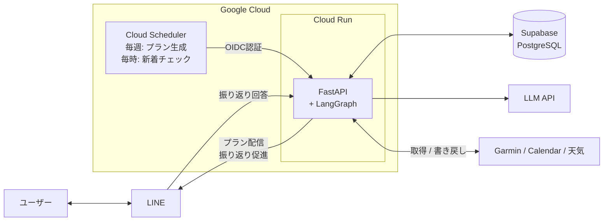
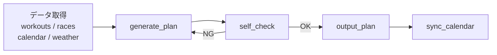

# run-coach

自分のランニング計画を見直すとき、毎回 Garmin の記録や予定を見ながら判断していたため、その作業を半自動化する目的で作っている個人開発です。Garmin の実績、カレンダー、天気、大会情報をもとに、週次のトレーニングプランを生成します。

## 現在実装していること

- Garmin Connect のワークアウト履歴・体調・レース予測をもとに、LLM が週次プランを生成
- Google Calendar の空き枠・天気予報・大会情報を加味してスケジュール調整
- コーチングルール（負荷上限・テーパリング等）でプランを自動検証し、違反時は再生成
- 生成プランを Google Calendar に登録し、LINE でプラン配信
- ラン後に LINE で振り返りを促し、回答を DB に記録（必要に応じて Garmin description に反映）

## 実装上のポイント

- 各処理を `AgentState` を受け取り返す関数にして、LangGraph でフロー制御。セルフチェックで違反があれば再生成に戻るループも含めてグラフで定義している
- LLM の出力を含め、すべてのデータを Pydantic v2 のスキーマで定義し、型が合わなければエラーにしている
- Cloud Scheduler → Cloud Run は OIDC トークン検証、LINE Webhook は署名検証。LLM には氏名・メール・GPS座標などの識別情報は送らない

## 動かし方

```bash
make up            # Docker で app + db 起動
make local-coach   # プラン生成（JSON整形出力）
```

## アーキテクチャ



### LangGraph ワークフロー



## 技術スタック

| カテゴリ       | 技術                                                           |
| -------------- | -------------------------------------------------------------- |
| 言語           | Python 3.11+ / uv                                              |
| AIエージェント | LangGraph / OpenAI API                                         |
| スキーマ       | Pydantic v2                                                    |
| API            | FastAPI                                                        |
| DB             | PostgreSQL (Supabase) / SQLAlchemy / Alembic                   |
| 外部連携       | Garmin Connect / Google Calendar / Open-Meteo / LINE Messaging |
| インフラ       | Cloud Run / Cloud Scheduler / Secret Manager / Terraform       |
| セキュリティ   | gitleaks / OIDC トークン検証 / LINE署名検証                    |

## 設計ドキュメント

全体設計は [DESIGN.md](DESIGN.md)、各フェーズの詳細は [docs/](docs/) を参照。
