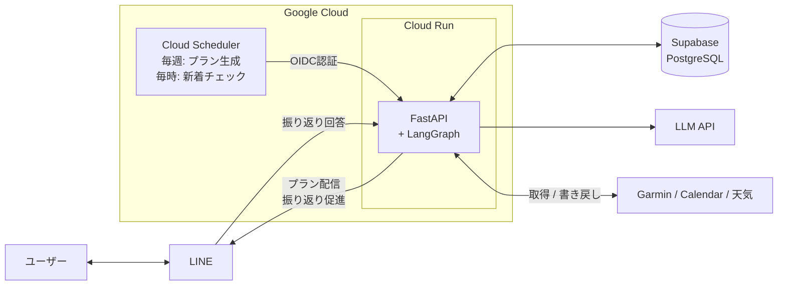
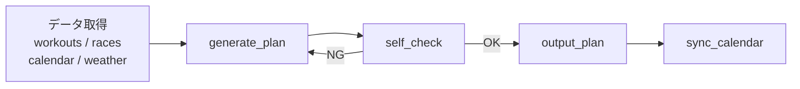

# run-coach

ランニング用AIコーチ。Garmin Connect の実績データをもとに、週次トレーニングプランを自動生成してLINEで配信する。

- Garmin Connect からワークアウト履歴・体調・レース予測を取得
- Google Calendar・天気予報・大会情報を加味してプランを生成
- コーチングルール（負荷上限・テーパリング等）で自動検証、違反時は再生成
- LINE でプラン配信、ラン後に振り返りを促して記録を蓄積

## アーキテクチャ

### LangGraph ワークフロー

各ノードは `AgentState` を受け取り返す関数。セルフチェックで違反検出時はプラン再生成にループバックする。

## 技術スタック

| カテゴリ       | 技術                                                           |
| -------------- | -------------------------------------------------------------- |
| 言語           | Python 3.11+ / uv                                              |
| AIエージェント | LangGraph / OpenAI API                                         |
| スキーマ       | Pydantic v2                                                    |
| API            | FastAPI                                                        |
| DB             | PostgreSQL (Supabase) / SQLAlchemy / Alembic                   |
| 外部連携       | Garmin Connect / Google Calendar / Open-Meteo / LINE Messaging |
| インフラ       | Cloud Run / Cloud Scheduler / Secret Manager / Terraform       |
| セキュリティ   | gitleaks / OIDC トークン検証 / LINE署名検証                    |

## 設計ドキュメント

全体設計は [DESIGN.md](DESIGN.md)、各フェーズの詳細は [docs/](docs/) を参照。
