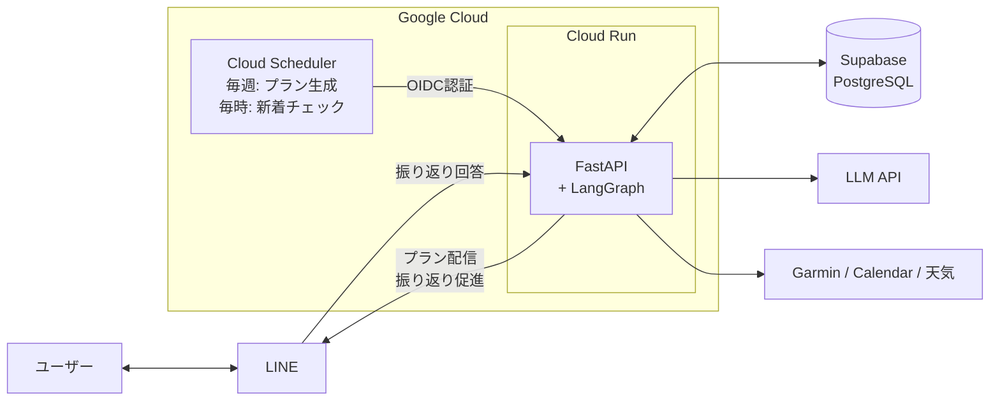
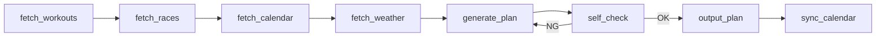

# run-coach

Garmin Connect のワークアウト履歴・スケジュール・天気予報・大会情報をもとに、LLM が週次トレーニングプランを自動生成するAIエージェント。生成プランはコーチングルールで自動検証し、LINE で配信する。

## アーキテクチャ



### LangGraph ワークフロー



各ノードは `AgentState` を受け取り返す関数。セルフチェックで違反検出時はプラン再生成にループバックする。

## 技術スタック

| カテゴリ | 技術 |
|---|---|
| 言語 | Python 3.11+ / uv |
| AIエージェント | LangGraph / OpenAI API |
| スキーマ | Pydantic v2 |
| API | FastAPI |
| DB | PostgreSQL (Supabase) / SQLAlchemy / Alembic |
| 外部連携 | Garmin Connect / Google Calendar / Open-Meteo / LINE Messaging |
| インフラ | Cloud Run / Cloud Scheduler / Secret Manager / Terraform |
| セキュリティ | gitleaks / OIDC トークン検証 / LINE署名検証 |

## セットアップ

```bash
uv sync
cp config/profile.example.yaml config/profile.yaml
# config/profile.yaml を編集
```

### 環境変数

| 変数名 | 用途 |
|---|---|
| `GARMIN_EMAIL` | Garmin Connect メールアドレス |
| `GARMIN_PASSWORD` | Garmin Connect パスワード |
| `OPENAI_API_KEY` | OpenAI API キー |
| `DATABASE_URL` | PostgreSQL 接続文字列 |
| `GOOGLE_CALENDAR_ID` | Google Calendar ID |
| `RUN_COACH_LINE_CHANNEL_ACCESS_TOKEN` | LINE Channel Access Token |
| `RUN_COACH_LINE_CHANNEL_SECRET` | LINE Channel Secret |
| `RUN_COACH_LINE_USER_ID` | LINE User ID |

## 使い方

```bash
# CLI実行
uv run python -m run_coach

# Docker
make up            # app + db 起動
make local-coach   # プラン生成
make down          # 停止
make help          # 全コマンド一覧
```

## テスト

```bash
uv run pytest tests/ -v
```

## 設計ドキュメント

全体設計は [DESIGN.md](DESIGN.md)、各フェーズの詳細は [docs/](docs/) を参照。
