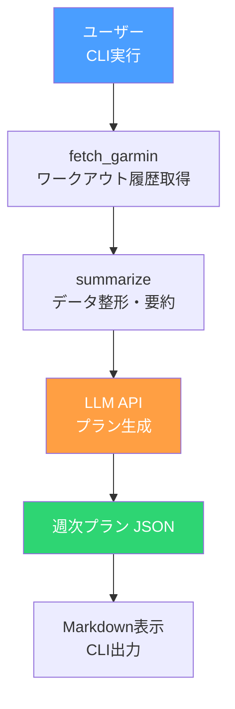

# Phase 1: 最小MVP

Garmin + LLM だけで動く最小構成。

## ゴール

CLIで実行すると来週のトレーニング計画がJSON + Markdownで出力される。

## フロー



## やること

- [ ] Garminからワークアウト履歴を取得（`python-garminconnect`）
- [ ] レース予測タイムを取得（`get_race_predictions()`）
- [ ] 取得データを要約してLLMに渡せる形に整形
- [ ] stateスキーマをPydanticで定義（最小限）
- [ ] システムプロンプトにコーチ知識を記述
- [ ] LLM APIで週次プランを**構造化JSON**で生成
- [ ] JSON → Markdown変換してCLI表示

## State（この時点）

```python
class AgentState(BaseModel):
    user_profile: UserProfile       # 生年月日, 目標, 頻度(min~max), 怪我歴
    signals: Signals                # 直近のワークアウト, HRVトレンド, レース予測
    plan: Plan | None = None        # 生成された週次プラン
```

## テスト方針

- [ ] `summarize_activity()`: Garmin生データ → 要約dictの変換が正しいか
- [ ] Pydanticスキーマ: 不正なデータでバリデーションエラーが出るか
- [ ] LLM出力のJSON検証: Planスキーマに準拠しているか（日付、workout_type等）
- [ ] JSON → Markdown変換: 表形式で正しく出力されるか

```python
# テスト例
def test_summarize_activity():
    raw = {"startTimeLocal": "2026-03-01 08:00", "distance": 10000, "duration": 3000, ...}
    result = summarize_activity(raw)
    assert result["distance_km"] == 10.0
    assert result["duration_min"] == 50.0

def test_plan_schema_validation():
    valid = Plan(week_start="2026-03-09", days=[...], load_summary="...", rationale="...")
    assert valid.week_start == "2026-03-09"

    with pytest.raises(ValidationError):
        Plan(week_start=None, days=[], load_summary="", rationale="")
```

## 入出力イメージ

```bash
$ uv run python -m run_coach

# 直近2週間のワークアウトを取得...
# LLMにプラン生成を依頼...

## 来週のトレーニング計画 (2026-03-09 〜)

| 日付  | メニュー    | 目的         | 時間  | 強度 | HR上限 | メモ           |
|-------|-----------|-------------|-------|------|--------|---------------|
| 03/09 | イージーラン | 疲労抜き      | 40分  | 低   | 140    |               |
| 03/11 | テンポ走    | 閾値向上      | 50分  | 高   | 165    | 4:30/kmで20分  |
| 03/13 | イージーラン | 有酸素ベース   | 40分  | 低   | 145    |               |
| 03/15 | ロング走    | 持久力養成    | 90分  | 中   | 155    | LSD 15km      |

理由: 先週のロング走で心拍が高めだったため、高強度を1回に抑えテンポ走に集中。
```
