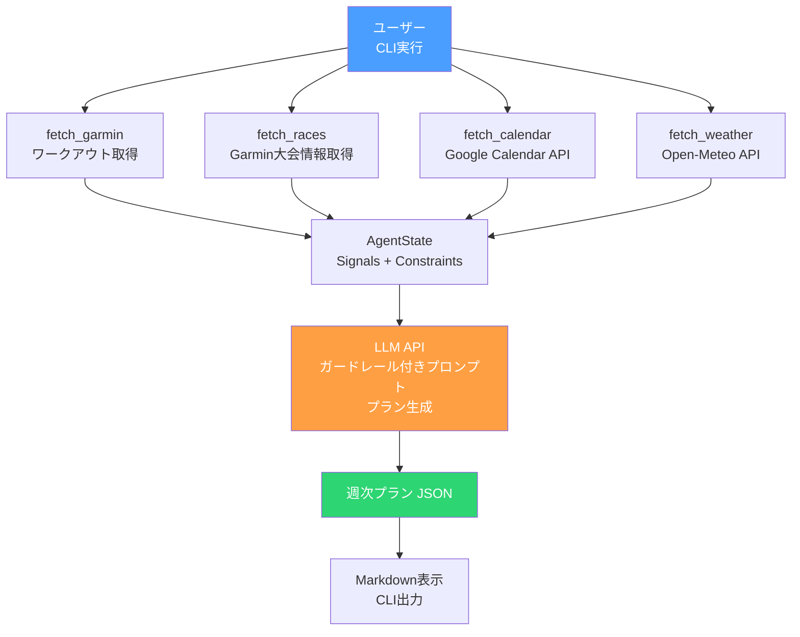

# Phase 1.5: データソース追加 + ガードレール

Phase 1に加えて、カレンダー・天気・大会情報を取り込み、ガードレールを導入。

## ゴール

ユーザーのスケジュール・天気・大会を考慮した現実的なプランを生成する。

## フロー



## やること

- [ ] Google Calendar APIでカレンダーの空き時間を取得
- [ ] Open-Meteo APIで天気予報を取得
- [ ] Garminから大会情報を取得（`/calendar-service/year/{year}/month/{month}`）
- [ ] 大会詳細を取得（`/calendar-service/event/{id}`）
- [ ] Constraintsスキーマに空き枠・天気・大会を格納
- [ ] ガードレール（コーチングルール）をSYSTEM_PROMPTに導入
- [ ] UserProfileにlocation（緯度・経度）を追加

## データソース詳細

### Google Calendar API
- OAuth 2.0認証（デスクトップアプリ）
- `config/client_secret.json` にクライアントIDを配置（gitignore対象）
- 初回実行時にブラウザ認証 → `config/token.json` が生成される
- Events.list APIで7日間のイベントを取得

### Open-Meteo API
- APIキー不要・無料・無制限
- `https://api.open-meteo.com/v1/forecast` エンドポイント
- 気温、降水確率、降水量、風速を取得
- `profile.yaml` の `location`（緯度・経度）を使用

### Garmin大会情報
- `client.garth.get("/calendar-service/year/{year}/month/{month}")` で月別カレンダー取得
- `item["itemType"] == "event" and item.get("isRace")` でレースをフィルタ
- `client.garth.get(f"/calendar-service/event/{event_id}")` で詳細取得
- 今後3ヶ月分をスキャン

## State（追加分）

```python
class Location(BaseModel):
    latitude: float
    longitude: float

class CalendarSlot(BaseModel):
    date: date
    available: bool
    events: list[str] = []

class DailyWeather(BaseModel):
    date: date
    temperature_max: float       # ℃
    temperature_min: float       # ℃
    precipitation_probability: int  # 0-100%
    precipitation_sum: float     # mm
    wind_speed_max: float        # km/h

class RaceEvent(BaseModel):
    event_name: str
    date: date
    distance_km: float | None = None
    goal_time_seconds: float | None = None
    location: str | None = None
    is_primary: bool = False

class Constraints(BaseModel):
    available_slots: list[CalendarSlot] = []
    weather: list[DailyWeather] = []
    races: list[RaceEvent] = []

class UserProfile(BaseModel):
    ...
    location: Location | None = None  # ← 追加

class AgentState(BaseModel):
    ...
    constraints: Constraints = Constraints()  # ← 追加
```

## テスト方針

- [ ] Constraints/Location スキーマのバリデーション
- [ ] CalendarSlotスキーマ、スロット生成ロジック
- [ ] DailyWeatherスキーマ
- [ ] RaceEventスキーマ（フル/最小フィールド）

## ガードレール（コーチングルール）

SYSTEM_PROMPTに組み込む固定ルール。RAG不要。

1. 高強度セッション（tempo, intervals）は週2回まで
2. ロング走の翌日は必ずイージーランまたは休養
3. 週間走行距離の増加は前週比10%以内
4. レース3週間前からテーパリング開始
5. HRV低下 + 睡眠不足の場合は回復優先
6. 降水確率60%以上の日は室内トレや代替メニューを提案
7. カレンダーで予定が多い日にはワークアウトを入れない
8. ロング走は土日または祝日に配置
