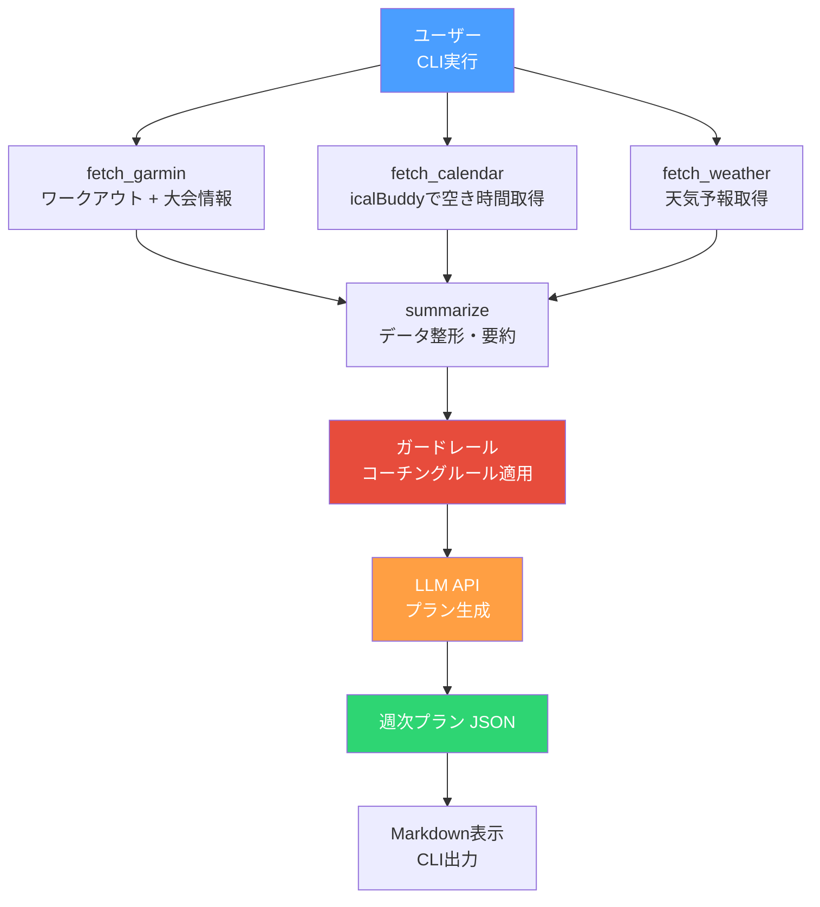

# Phase 1.5: データソース追加 + ガードレール

Phase 1に加えて、カレンダー・天気・大会情報を取り込み、ガードレールを導入。

## ゴール

ユーザーのスケジュール・天気・大会を考慮した現実的なプランを生成する。

## フロー



## やること

- [ ] カレンダーから空き時間を取得（`icalBuddy`）
- [ ] 天気予報を取得（OpenWeatherMap API等）
- [ ] Garminから大会情報を取得（`/calendar-service/year/{year}/month/{month}`）
- [ ] 大会詳細を取得（`/calendar-service/event/{id}`）
- [ ] Constraintsスキーマに空き枠・天気・大会を格納
- [ ] ガードレール（コーチングルール）を導入

## State（追加分）

```python
class Constraints(BaseModel):
    available_slots: list[dict]  # カレンダーの空き枠
    weather: list[dict]          # 向こう7日の天気予報
    races: list[dict]            # Garminから取得した大会情報

class AgentState(BaseModel):
    user_profile: UserProfile
    signals: Signals
    constraints: Constraints     # ← Phase 1.5で追加
    plan: Plan | None = None
```

## テスト方針

- [ ] ガードレール: 各ルール違反を正しく検出できるか
- [ ] Constraintsスキーマ: 空き枠・天気・大会データのバリデーション
- [ ] カレンダー取得: icalBuddyの出力パース
- [ ] 大会情報取得: Garmin APIレスポンスのパース

```python
# テスト例: ガードレール
def test_reject_too_many_hard_sessions():
    plan = Plan(days=[
        {"workout_type": "tempo", "intensity": "high", ...},
        {"workout_type": "interval", "intensity": "high", ...},
        {"workout_type": "long_run", "intensity": "high", ...},
    ], ...)
    violations = check_guardrails(plan)
    assert "max_hard_sessions" in violations

def test_reject_hard_after_long_run():
    plan = Plan(days=[
        {"date": "2026-03-14", "workout_type": "long_run", ...},
        {"date": "2026-03-15", "workout_type": "tempo", "intensity": "high", ...},
    ], ...)
    violations = check_guardrails(plan)
    assert "rest_after_long_run" in violations

def test_no_workout_on_busy_day():
    constraints = Constraints(available_slots=[
        {"date": "2026-03-10", "available": False},
    ], ...)
    plan = Plan(days=[
        {"date": "2026-03-10", "workout_type": "easy_run", ...},
    ], ...)
    violations = check_guardrails(plan, constraints)
    assert "no_available_slot" in violations
```

## ガードレール（コーチングルール）

プロンプトまたはコードに組み込む固定ルール。RAG不要。

- 週2回以上の高強度を入れない
- ロング走の翌日は原則イージーまたは休息
- 週間走行距離の増加は前週比10%以内
- レース3週間前からテーパリング開始
- HRV低下 + 睡眠不足の場合は回復優先
- 雨天の場合は代替メニュー（室内トレ等）を提案
- カレンダーの空きがない日には練習を入れない
