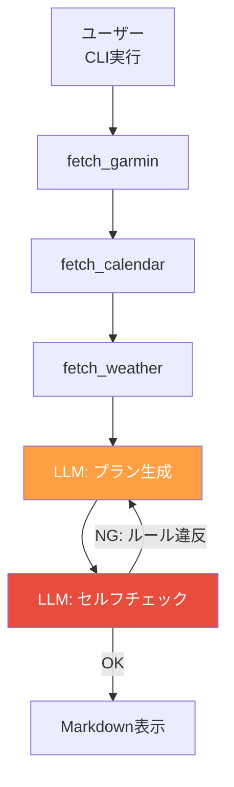

# Phase 2: セルフチェック

別のLLM呼び出しで生成済みプランを検証し、ガードレール違反や負荷の偏りを検出する。

## ゴール

プラン生成後に自動で品質チェックを行い、問題があれば再生成する仕組みを作る。

## フロー



## やること

- [ ] セルフチェック用プロンプトの設計
- [ ] `self_check()` 関数の実装（state in / state out）
- [ ] 再生成ループ（最大リトライ回数の制限）
- [ ] チェック結果のログ出力
- [ ] テスト

## チェック項目

ガードレールと同じルールをLLMに検証させる:

1. 高強度セッション（tempo, intervals）が週2回を超えていないか
2. ロング走の翌日がイージーランまたは休養か
3. 週間走行距離の増加が前週比10%以内か
4. レース3週間前からテーパリングが始まっているか
5. HRV低下時にリカバリー優先になっているか
6. 降水確率60%以上の日に屋外メニューが入っていないか
7. カレンダーで予定が多い日にワークアウトが入っていないか

## セルフチェック関数

```python
SELF_CHECK_MAX_RETRIES = 3

def self_check(state: AgentState) -> AgentState:
    """LLMで生成済みプランを検証する。
    NGの場合は理由をstateに記録。"""

def run_plan_with_check(state: AgentState) -> AgentState:
    """generate_plan + self_check をリトライ付きで実行。
    最大 SELF_CHECK_MAX_RETRIES 回まで再生成。"""
```

## セルフチェック用プロンプト（案）

```
以下のトレーニング計画を検証してください。

## 検証ルール
1. 高強度セッション（tempo, intervals）は週2回まで
2. ロング走の翌日は必ずイージーランまたは休養
...（ガードレールと同じ）

## 選手のプロフィール
{profile}

## 生成されたプラン
{plan_json}

## 出力形式（JSONのみ）
{
  "result": "ok" | "ng",
  "violations": ["違反内容1", "違反内容2"],
  "suggestions": ["改善提案1", "改善提案2"]
}
```

## テスト方針

- [ ] OK判定: ルールに準拠したプランが通ること
- [ ] NG判定: ルール違反のプランが検出されること
- [ ] リトライ上限: 最大リトライ回数を超えたら最後のプランを採用すること
- [ ] チェック結果のログ: violations / suggestions が記録されること

```python
def test_self_check_passes_valid_plan():
    """ルール準拠のプランがOKになること"""
    state = AgentState(plan=valid_plan, ...)
    result = self_check(state)
    assert result.self_check_result == "ok"

def test_self_check_rejects_too_many_high_intensity():
    """高強度が3回以上のプランがNGになること"""
    state = AgentState(plan=plan_with_3_high_intensity, ...)
    result = self_check(state)
    assert result.self_check_result == "ng"

def test_retry_limit():
    """リトライ上限に達したら最後のプランを返すこと"""
    # LLMモック: 常にNG判定を返す
    state = run_plan_with_check(state)
    assert state.plan is not None  # 最後のプランが残る
```

## State（追加分）

```python
class AgentState(BaseModel):
    user_profile: UserProfile
    signals: Signals
    constraints: Constraints
    plan: Plan | None = None
    self_check_result: str | None = None  # "ok" | "ng"
    self_check_violations: list[str] = Field(default_factory=list)
```
