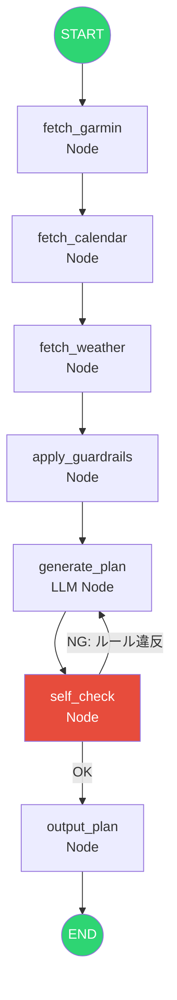

# Phase 3: LangGraph でフロー制御移行

自前実装のフロー制御をLangGraphのステートグラフに置き換える。機能追加はしない。

## ゴール

Phase 1〜2で作った自前のフロー制御（関数の順次呼び出し + if文分岐）をLangGraphのStateGraphに載せ替える。
**既存の動作を変えずに、フロー制御の仕組みだけを入れ替える。**

## フロー



## やること

- [ ] AgentStateをLangGraphのState定義に移行
- [ ] 各関数をLangGraphのNodeとして登録
- [ ] Edge（直線フロー）の定義
- [ ] Conditional Edge（セルフチェック結果による分岐）の定義

## 自前実装 → LangGraph の対応

| 自前実装 | LangGraph |
|--|--|
| `def fetch_garmin(state)` | `graph.add_node("fetch_garmin", fetch_garmin)` |
| `def generate_plan(state)` | `graph.add_node("generate_plan", generate_plan)` |
| 順次呼び出し (`run()`) | `graph.add_edge("fetch_garmin", "fetch_calendar")` |
| if文での分岐 | `graph.add_conditional_edges("self_check", ...)` |

## コードイメージ

```python
from langgraph.graph import StateGraph, END

graph = StateGraph(AgentState)

# ノード登録（Phase 1〜2の既存関数をそのまま使う）
graph.add_node("fetch_garmin", fetch_garmin)
graph.add_node("fetch_calendar", fetch_calendar)
graph.add_node("fetch_weather", fetch_weather)
graph.add_node("apply_guardrails", apply_guardrails)
graph.add_node("generate_plan", generate_plan)
graph.add_node("self_check", self_check)
graph.add_node("output_plan", output_plan)

# エッジ
graph.set_entry_point("fetch_garmin")
graph.add_edge("fetch_garmin", "fetch_calendar")
graph.add_edge("fetch_calendar", "fetch_weather")
graph.add_edge("fetch_weather", "apply_guardrails")
graph.add_edge("apply_guardrails", "generate_plan")
graph.add_edge("generate_plan", "self_check")

# 条件分岐: セルフチェック
graph.add_conditional_edges("self_check", check_result, {
    "ok": "output_plan",
    "ng": "generate_plan",
})

graph.add_edge("output_plan", END)

app = graph.compile()
```

## テスト方針

最重要: **Phase 1〜2で書いたテストがそのまま通ること**。

- [ ] 既存テスト全通し: LangGraph移行で動作が変わっていないことを確認
- [ ] ノード単体テスト: 各ノードが正しいstateを返すか
- [ ] 条件分岐テスト: セルフチェックのOK/NG分岐が正しく動くか
- [ ] ループ上限テスト: セルフチェックNGが無限ループしないか
- [ ] グラフ全体の結合テスト: START→ENDまで正常に完走するか

```python
# テスト例
def test_existing_tests_still_pass():
    """Phase 1-2のテストが全て通ることを確認"""
    # pytest で既存テストを実行するだけ
    # 移行の安全ネット

def test_self_check_rejects_bad_plan():
    state = AgentState(
        plan=Plan(days=[
            {"workout_type": "interval", "intensity": "high", ...},
            {"workout_type": "tempo", "intensity": "high", ...},
            {"workout_type": "long_run", "intensity": "high", ...},
        ], ...),
        ...
    )
    result = self_check(state)
    assert result["self_check_result"] == "ng"

def test_no_infinite_loop():
    """セルフチェックNGが3回続いたら強制終了"""
    state = AgentState(...)
    app = graph.compile()
    result = app.invoke(state, config={"recursion_limit": 5})
    assert result["plan"] is not None
```
