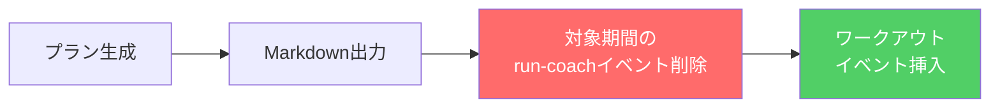

# Phase 3.5: カレンダー同期

生成したトレーニングプランをGoogle Calendarに自動登録する。

## ゴール

- プラン生成後、ワークアウトをGoogle Calendarの終日イベントとして登録
- 実行の度にイベントが増殖しない（冪等性）
- run-coachが作成したイベントを識別可能にする

## フロー



## イベントの識別

Google Calendar APIの `extendedProperties.private` を使用:

```json
{"created_by": "run-coach"}
```

- APIの `privateExtendedProperty` パラメータでフィルタ検索可能
- ユーザーのカレンダーUIには表示されない内部メタデータ

## 冪等性の担保

1. `week_start` ～ 最終ワークアウト日を対象期間とする
2. 対象期間内の `created_by=run-coach` イベントを全件削除
3. 新しいプランのワークアウトを挿入

## イベント構造

| フィールド | 内容 | 例 |
|--|--|--|
| summary | `{種目} ({時間}min)` | `テンポ走 (50min)` |
| start/end | 終日イベント | `2026-03-11` / `2026-03-12` |
| description | 目的・強度・HR上限・メモ | `目的: 閾値向上\n強度: 高\nHR上限: 165` |
| extendedProperties | 識別用メタデータ | `{"created_by": "run-coach"}` |

## SCOPESの変更

`calendar.readonly` → `calendar.events`（読み書き）

初回実行時に再認証が必要（`~/.run-coach/token.json` を削除して再実行）。

## 実装

- [x] `run_coach/calendar.py` — `sync_plan_to_calendar()` ノード追加
- [x] `run_coach/graph.py` — `output_plan → sync_calendar → notify_line → END`
- [x] `tests/test_calendar_sync.py` — ユニットテスト

## テスト方針

- `_build_event_body`: イベント構造の正しさ（タイトル、日付、説明、extendedProperties）
- `_delete_run_coach_events`: 削除APIの呼び出しとフィルタパラメータ
- `sync_plan_to_calendar`: rest除外、プランなしスキップ、client_secretなしスキップ
