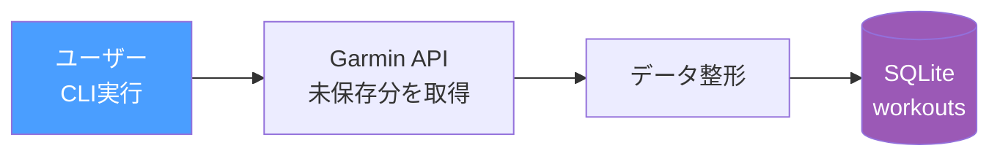
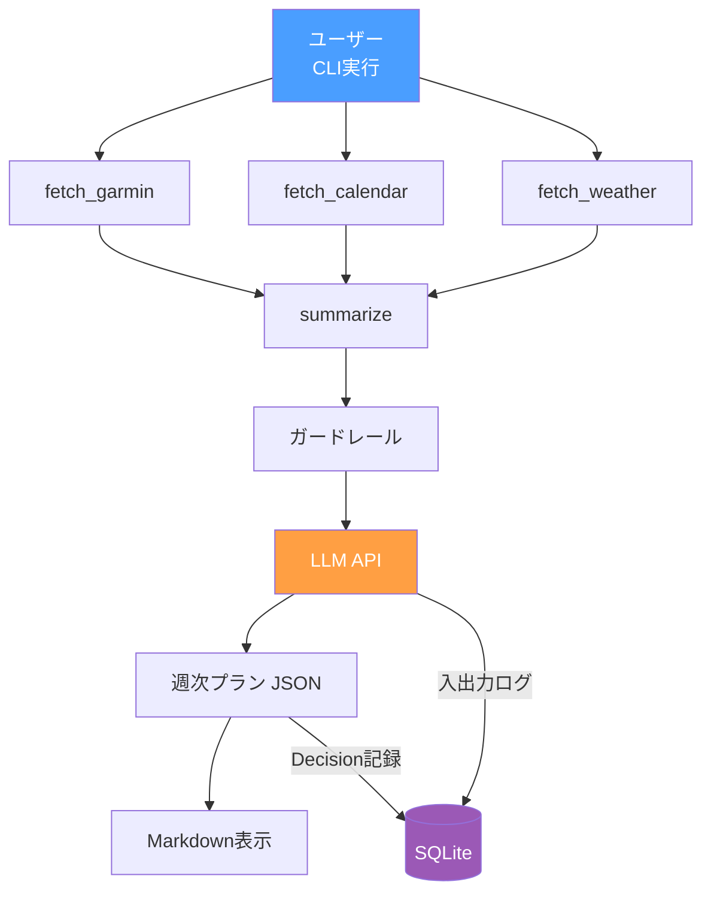
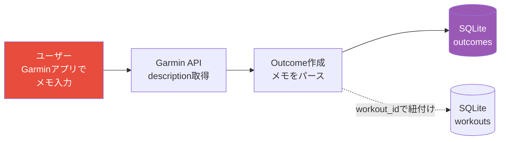

# Phase 4: データ蓄積 + ログ

SQLiteにデータを蓄積し、LLMの入出力ログとHuman-in-the-loopのログ基盤を構築。

## ゴール

プラン生成の判断過程と結果を記録し、「エージェントが学習する」基盤を作る。

## フロー

データの保存は3つの異なるタイミングで発生する。

### ① ワークアウト保存（CLI実行時に未保存分を取得）



### ② プラン生成時



### ③ 振り返り取得（Garmin descriptionから）

ユーザーはラン後にGarminアプリのワークアウト詳細のメモ欄（description）に振り返りを入力する。
CLI実行時にワークアウトと一緒にdescriptionを取得し、Outcomeとして保存する。



> **Note**: Phase 7（LINE通知）導入後は、LINEからの振り返り入力も追加予定。
> Garmin descriptionは最もシンプルな振り返り収集手段として引き続き利用。

### タイミングまとめ

| タイミング | トリガー | 保存先 |
|--|--|--|
| ワークアウト保存 | CLI実行時に未保存分を取得 | `workouts` |
| プラン生成 | ユーザーがCLI実行 | `llm_calls` + `decisions` |
| 振り返り取得 | CLI実行時にGarmin descriptionから | `outcomes`（workout_idで紐付け） |

## やること

- [ ] SQLiteスキーマ設計・テーブル作成
- [ ] ワークアウトログの蓄積（Garminから取得→SQLite保存）
- [ ] LLM入出力ログの記録（プロンプト、レスポンス、トークン数、レイテンシ）
- [ ] Decisionテーブル: 生成したプラン + 入力データの要約
- [ ] Outcomeテーブル: 実施結果 + 主観評価
- [ ] Garmin descriptionからの振り返り取得・パース

## SQLiteテーブル設計

```sql
-- ワークアウトログ（全体サマリー）
CREATE TABLE workouts (
    id INTEGER PRIMARY KEY,
    garmin_activity_id TEXT UNIQUE,
    date TEXT,
    workout_type TEXT,
    distance_km REAL,
    duration_min REAL,
    avg_pace TEXT,
    avg_hr INTEGER,
    training_effect REAL,
    description TEXT,           -- Garminのメモ
    created_at TIMESTAMP DEFAULT CURRENT_TIMESTAMP
);

-- 1km毎のラップ詳細
CREATE TABLE workout_splits (
    id INTEGER PRIMARY KEY,
    workout_id INTEGER REFERENCES workouts(id),
    split_number INTEGER,       -- 1, 2, 3...
    distance_km REAL,
    duration_sec REAL,
    avg_pace TEXT,
    avg_hr INTEGER,
    max_hr INTEGER,
    elevation_gain REAL,
    created_at TIMESTAMP DEFAULT CURRENT_TIMESTAMP
);

-- 心拍の時系列データ（調子判断用）
CREATE TABLE workout_hr_timeseries (
    id INTEGER PRIMARY KEY,
    workout_id INTEGER REFERENCES workouts(id),
    elapsed_sec INTEGER,        -- 経過秒
    heart_rate INTEGER,
    created_at TIMESTAMP DEFAULT CURRENT_TIMESTAMP
);

-- LLM呼び出しログ
CREATE TABLE llm_calls (
    id INTEGER PRIMARY KEY,
    prompt TEXT,
    response TEXT,
    model TEXT,
    tokens_in INTEGER,
    tokens_out INTEGER,
    latency_ms INTEGER,
    prompt_version TEXT,
    created_at TIMESTAMP DEFAULT CURRENT_TIMESTAMP
);

-- Decision: エージェントの判断
CREATE TABLE decisions (
    id INTEGER PRIMARY KEY,
    plan_json TEXT,              -- 生成した週次プラン
    inputs_summary TEXT,         -- 判断に使ったデータの要約
    llm_call_id INTEGER REFERENCES llm_calls(id),
    created_at TIMESTAMP DEFAULT CURRENT_TIMESTAMP
);

-- Outcome: 実施結果
CREATE TABLE outcomes (
    id INTEGER PRIMARY KEY,
    decision_id INTEGER REFERENCES decisions(id),
    workout_id INTEGER REFERENCES workouts(id),
    status TEXT,                 -- completed / modified / skipped
    rpe INTEGER,                -- 主観的運動強度 (1-10)
    pain TEXT,                  -- 痛みの部位・程度
    comment TEXT,               -- 自由コメント
    created_at TIMESTAMP DEFAULT CURRENT_TIMESTAMP
);
```

## テスト方針

- [ ] workouts CRUD: 保存・取得・重複排除（garmin_activity_id UNIQUE）
- [ ] llm_calls 記録: プロンプト・レスポンス・メタデータが正しく保存されるか
- [ ] decisions 記録: plan_json + inputs_summary が正しく保存されるか
- [ ] outcomes 記録: workout_id / decision_id の紐付けが正しいか
- [ ] 未保存分の検出: 既にSQLiteにあるワークアウトを重複保存しないか

```python
# テスト例
def test_save_and_get_workout(db):
    workout = {"garmin_activity_id": "123", "date": "2026-03-01", "distance_km": 10.0, ...}
    save_workout(db, workout)
    result = get_workout_by_garmin_id(db, "123")
    assert result["distance_km"] == 10.0

def test_no_duplicate_workout(db):
    workout = {"garmin_activity_id": "123", ...}
    save_workout(db, workout)
    save_workout(db, workout)  # 2回目
    assert count_workouts(db) == 1

def test_outcome_links_to_workout(db):
    save_workout(db, {"garmin_activity_id": "123", ...})
    workout = get_workout_by_garmin_id(db, "123")
    save_outcome(db, {"workout_id": workout["id"], "status": "completed", "rpe": 7, ...})
    outcome = get_outcomes_by_workout(db, workout["id"])
    assert outcome[0]["status"] == "completed"
```

## State（追加分）

```python
class AgentState(BaseModel):
    user_profile: UserProfile
    signals: Signals
    constraints: Constraints
    plan: Plan | None = None
    logs: list[dict] | None = None  # ← Phase 4で追加
```
