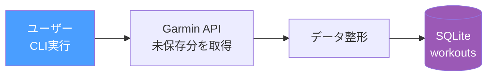
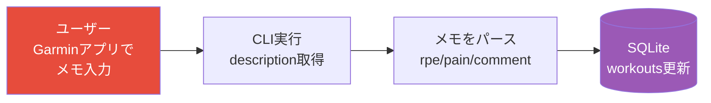

# Phase 4: データ蓄積 + ログ

SQLiteにGarminのワークアウトデータを蓄積し、プラン生成の入力データ基盤を構築する。

## ゴール

過去のワークアウト履歴と振り返りを蓄積し、LLMがパーソナライズされたプランを生成するためのデータ基盤を作る。

> **Note**: LLMの入出力ログはLangSmithで管理する（自前DBには保存しない）。
> **Note**: workout_splits（1km毎のラップデータ）はPhase 4.5で実装する。

## フロー

データの保存は2つのタイミングで発生する。

### ① ワークアウト保存（CLI実行時に未保存分を取得）



### ② 振り返り取得（Garmin descriptionをパース）

ユーザーがラン後にGarminアプリのメモ欄（description）に振り返りを記入する。
CLI実行時にdescriptionを取得し、パースしてworkoutsテーブルのrpe・pain・commentを更新する。

descriptionの書式は自由。`RPE:7` `痛み:右ひざ` `コメント:調子良い` のようなキーワード行があればパースし、なければ全文をcommentとして保存する。



> **Note**: Phase 7（LINE通知）導入後は、LINEからの振り返り入力も追加予定。

### タイミングまとめ

| タイミング | トリガー | 保存先 |
|--|--|--|
| ワークアウト保存 | CLI実行時に未保存分を取得 | `workouts` |
| 振り返り取得 | CLI実行時にGarmin descriptionをパース | `workouts`（rpe/pain/commentを更新） |

## やること

- [ ] SQLiteスキーマ設計・テーブル作成（workouts）
- [ ] ワークアウトログの蓄積（Garminから取得→SQLite保存）
- [ ] Garmin descriptionからの振り返り取得・パース → workoutsのrpe/pain/commentを更新

## SQLiteテーブル設計

```sql
-- ワークアウトログ（全体サマリー）
CREATE TABLE workouts (
    id                    INTEGER PRIMARY KEY,
    garmin_activity_id    TEXT UNIQUE,          -- Garmin Connect のアクティビティID
    date                  DATE,                 -- ワークアウト実施日
    workout_type          TEXT,                 -- running, trail_running, walking 等
    distance_km           REAL,                 -- 走行距離 (km)
    duration_min          REAL,                 -- 所要時間 (分)
    pace_seconds_per_km   REAL,                 -- 平均ペース (秒/km). 例: 5:30/km = 330.0
    avg_heart_rate_bpm    INTEGER,              -- 平均心拍数 (bpm)
    training_effect       REAL,                 -- Garmin 有酸素トレーニング効果 (0.0-5.0)
    description           TEXT,                 -- Garmin メモ欄の原文
    rpe                   INTEGER,              -- 主観的運動強度 (1-10), 振り返り時に更新
    pain                  TEXT,                 -- 痛みの部位・程度
    comment               TEXT,                 -- 自由コメント
    created_at            TIMESTAMP DEFAULT CURRENT_TIMESTAMP
);
```

> **Note**: workout_splitsテーブルはPhase 4.5で追加する。詳細は [docs/phase4.5-workout-splits.md](docs/phase4.5-workout-splits.md) を参照。

## テスト方針

- [ ] workouts CRUD: 保存・取得・重複排除（garmin_activity_id UNIQUE）
- [ ] 振り返り更新: descriptionパース → workoutsのrpe/pain/commentが正しく更新されるか
- [ ] 未保存分の検出: 既にSQLiteにあるワークアウトを重複保存しないか

```python
# テスト例
def test_save_and_get_workout(db):
    workout = {"garmin_activity_id": "123", "date": "2026-03-01", "distance_km": 10.0, ...}
    save_workout(db, workout)
    result = get_workout_by_garmin_id(db, "123")
    assert result["distance_km"] == 10.0

def test_no_duplicate_workout(db):
    workout = {"garmin_activity_id": "123", ...}
    save_workout(db, workout)
    save_workout(db, workout)  # 2回目
    assert count_workouts(db) == 1

def test_update_workout_feedback(db):
    save_workout(db, {"garmin_activity_id": "123", "date": "2026-03-01", ...})
    update_workout_feedback(db, "123", {"rpe": 7, "pain": None, "comment": "調子良かった"})
    result = get_workout_by_garmin_id(db, "123")
    assert result["rpe"] == 7
    assert result["comment"] == "調子良かった"
```

## State（追加分）

```python
class WorkoutSummary(BaseModel):
    # ... 既存フィールド ...
    garmin_activity_id: str | None = None  # ← Phase 4で追加
    description: str | None = None         # ← Phase 4で追加
```
