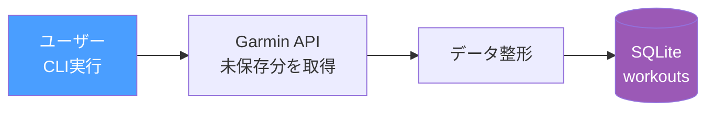

# Phase 4: データ蓄積 + ログ

SQLiteにGarminのワークアウトデータを蓄積し、プラン生成の入力データ基盤を構築する。

## ゴール

過去のワークアウト履歴と振り返りを蓄積し、LLMがパーソナライズされたプランを生成するためのデータ基盤を作る。

> **Note**: LLMの入出力ログはLangSmithで管理する（自前DBには保存しない）。

## フロー

データの保存は2つのタイミングで発生する。

### ① ワークアウト保存（CLI実行時に未保存分を取得）



### ② 振り返り取得（Garmin descriptionから）

ユーザーはラン後にGarminアプリのワークアウト詳細のメモ欄（description）に振り返りを入力する。
CLI実行時にワークアウトと一緒にdescriptionを取得し、パースしてworkoutsテーブルのrpe・pain・commentを更新する。


> **Note**: Phase 7（LINE通知）導入後は、LINEからの振り返り入力も追加予定。
> Garmin descriptionは最もシンプルな振り返り収集手段として引き続き利用。

### タイミングまとめ

| タイミング | トリガー | 保存先 |
|--|--|--|
| ワークアウト保存 | CLI実行時に未保存分を取得 | `workouts` + `workout_splits` |
| 振り返り取得 | CLI実行時にGarmin descriptionから | `workouts`（rpe/pain/commentを更新） |

## やること

- [ ] SQLiteスキーマ設計・テーブル作成（workouts + workout_splits）
- [ ] ワークアウトログの蓄積（Garminから取得→SQLite保存）
- [ ] Garmin descriptionからの振り返り取得・パース → workoutsのrpe/pain/commentを更新
- [ ] LangSmith連携（環境変数設定）

## SQLiteテーブル設計

```sql
-- ワークアウトログ（全体サマリー）
CREATE TABLE workouts (
    id INTEGER PRIMARY KEY,
    garmin_activity_id TEXT UNIQUE,
    date TEXT,
    workout_type TEXT,
    distance_km REAL,
    duration_min REAL,
    avg_pace TEXT,
    avg_hr INTEGER,
    training_effect REAL,
    description TEXT,           -- Garminのメモ
    rpe INTEGER,                -- 主観的運動強度 (1-10)、振り返り時に更新
    pain TEXT,                  -- 痛みの部位・程度
    comment TEXT,               -- 自由コメント
    created_at TIMESTAMP DEFAULT CURRENT_TIMESTAMP
);

-- 1km毎のラップ詳細
CREATE TABLE workout_splits (
    id INTEGER PRIMARY KEY,
    workout_id INTEGER REFERENCES workouts(id),
    split_number INTEGER,       -- 1, 2, 3...
    distance_km REAL,
    duration_sec REAL,
    avg_pace TEXT,
    avg_hr INTEGER,
    max_hr INTEGER,
    elevation_gain REAL,
    created_at TIMESTAMP DEFAULT CURRENT_TIMESTAMP
);
```

## テスト方針

- [ ] workouts CRUD: 保存・取得・重複排除（garmin_activity_id UNIQUE）
- [ ] workout_splits: ラップデータの保存・取得
- [ ] 振り返り更新: descriptionパース → workoutsのrpe/pain/commentが正しく更新されるか
- [ ] 未保存分の検出: 既にSQLiteにあるワークアウトを重複保存しないか

```python
# テスト例
def test_save_and_get_workout(db):
    workout = {"garmin_activity_id": "123", "date": "2026-03-01", "distance_km": 10.0, ...}
    save_workout(db, workout)
    result = get_workout_by_garmin_id(db, "123")
    assert result["distance_km"] == 10.0

def test_no_duplicate_workout(db):
    workout = {"garmin_activity_id": "123", ...}
    save_workout(db, workout)
    save_workout(db, workout)  # 2回目
    assert count_workouts(db) == 1

def test_update_workout_feedback(db):
    save_workout(db, {"garmin_activity_id": "123", "date": "2026-03-01", ...})
    update_workout_feedback(db, "123", {"rpe": 7, "pain": None, "comment": "調子良かった"})
    result = get_workout_by_garmin_id(db, "123")
    assert result["rpe"] == 7
    assert result["comment"] == "調子良かった"
```

## State（追加分）

```python
class AgentState(BaseModel):
    user_profile: UserProfile
    signals: Signals
    constraints: Constraints
    plan: Plan | None = None
    workout_history: list[dict] | None = None  # ← Phase 4で追加
```
