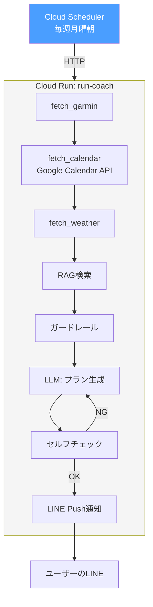
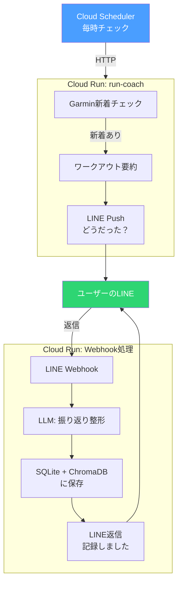
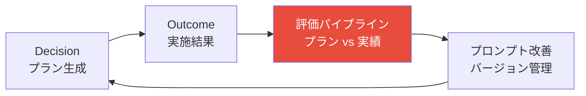

# Phase 5: Cloud Run + Cloud Scheduler デプロイ

Cloud Runにデプロイし、自動実行環境を構築。

## ゴール

Macを閉じていても自動でプラン生成・通知・振り返り収集が動く状態にする。

## フロー

### 週次プラン生成



### ラン後の自動振り返り



### LLMOps評価



## やること

### Cloud Run デプロイ

- [ ] Dockerfile作成
- [ ] Cloud Runサービスのデプロイ
- [ ] Cloud Schedulerの設定（週次プラン / Garmin新着チェック）
- [ ] Google Calendar APIのサービスアカウント設定
- [ ] Secret Managerで認証情報を管理（Garmin / LLM API / LINE）

### LINE連携（段階的に）

- [ ] LINE公式アカウント作成 + Messaging API設定
- [ ] Step 1: Push通知のみ（週次プラン / 今日のメニュー）
- [ ] Step 2: Webhook受信（ユーザーの返信を処理）
- [ ] Step 3: 振り返り記録（LINE → SQLite + ChromaDB）
- [ ] Step 4: 対話型プラン調整（「来週は水曜しか走れない」等）

### Garmin書き戻し（できたら嬉しいレベル）

- [ ] `garth.put()` でdescriptionフィールドに振り返りを書き戻し
- [ ] 実装時にAPIの挙動を要検証

### LLMOps評価基盤

- [ ] プロンプトバージョン管理（llm_callsテーブルのprompt_version）
- [ ] Decision vs Outcomeの比較（プランと実績のギャップ分析）
- [ ] 評価パイプライン（週次で自動評価）
- [ ] 改善ループ（評価結果をプロンプト改善にフィードバック）

## テスト方針

- [ ] 既存テスト全通し: Phase 1-4のテストがCloud Run環境でも通ること（LangGraph含む）
- [ ] Webhook処理: LINEからのリクエストを正しくパースできるか
- [ ] Push通知: LLM出力→LINE送信の変換が正しいか
- [ ] 認証: Secret Managerからの認証情報取得が動くか
- [ ] E2Eテスト: Cloud Scheduler → Cloud Run → LINE の一連の流れ

```python
# テスト例
def test_line_webhook_parse():
    """LINEからのWebhookリクエストをパースできるか"""
    raw = {"events": [{"type": "message", "message": {"text": "脚が重かった"}, ...}]}
    parsed = parse_line_webhook(raw)
    assert parsed["text"] == "脚が重かった"

def test_plan_to_line_message():
    """週次プランJSONをLINE送信用メッセージに変換"""
    plan = Plan(week_start="2026-03-09", days=[...], ...)
    message = format_plan_for_line(plan)
    assert "2026-03-09" in message
    assert "イージーラン" in message

def test_garmin_new_activity_detection():
    """前回チェック以降の新着ワークアウトを検出"""
    last_check = "2026-03-05T00:00:00"
    activities = [{"startTimeLocal": "2026-03-06 08:00", ...}]
    new = detect_new_activities(activities, last_check)
    assert len(new) == 1
```
