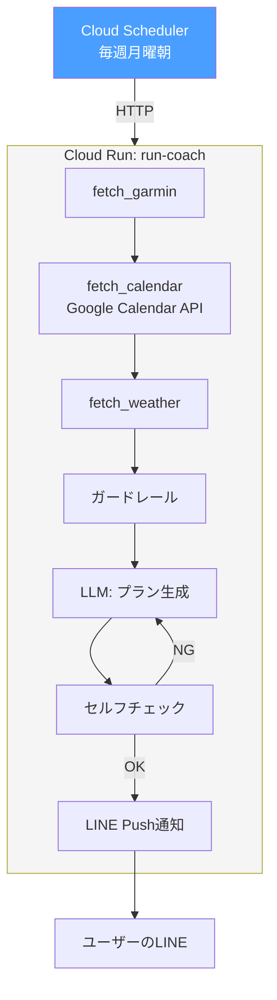

# Phase 5: Cloud Run + Cloud Scheduler デプロイ

Cloud Runにデプロイし、自動実行環境を構築。

## ゴール

Macを閉じていても自動でプラン生成・LINE通知が動く状態にする。

## フロー

### 週次プラン生成



## やること

### Cloud Run デプロイ

- [ ] Dockerfile作成
- [ ] Cloud Runサービスのデプロイ
- [ ] Cloud Schedulerの設定（週次プラン生成トリガー）
- [ ] Google Calendar APIのサービスアカウント設定
- [ ] Secret Managerで認証情報を管理（Garmin / LLM API / LINE）

### HTTPエンドポイント

- [ ] `/generate` — Cloud Schedulerから呼ばれ、プラン生成 → LINE Push通知
- [ ] ヘルスチェック用エンドポイント

## テスト方針

- [ ] 既存テスト全通し: Phase 1〜4のテストがCloud Run環境でも通ること
- [ ] 認証: Secret Managerからの認証情報取得が動くか
- [ ] HTTPエンドポイント: `/generate` が正しくプラン生成→LINE通知を実行するか
- [ ] E2Eテスト: Cloud Scheduler → Cloud Run → LINE の一連の流れ

```python
# テスト例
def test_generate_endpoint(client):
    """/generate エンドポイントが正常に動作するか"""
    response = client.post("/generate")
    assert response.status_code == 200

def test_secret_manager_integration():
    """Secret Managerから認証情報を取得できるか"""
    # モック環境での検証
    secret = get_secret("GARMIN_EMAIL")
    assert secret is not None
```
