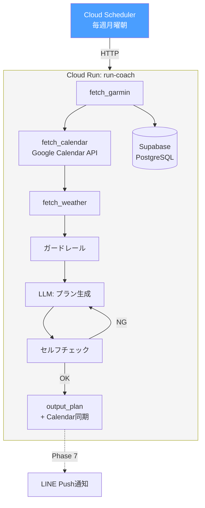

# Phase 6: Cloud Run + Cloud Scheduler デプロイ

Cloud Runにデプロイし、自動実行環境を構築する。

## ゴール

Macを閉じていても自動でプラン生成が動く状態にする。Phase 7（LINE通知）の前提基盤。

## 前提

- Phase 5 でPostgreSQL移行が完了していること
- Supabase PostgreSQL を利用できること
- Garmin / OpenAI / Google Calendar の認証情報をSecret Managerで管理できること
- HTTPエンドポイント用に `FastAPI` を採用すること

## フロー

### 週次プラン生成



## やること

### Cloud Run デプロイ

- [x] Dockerfile作成
- [x] FastAPIアプリ作成（`POST /internal/coach`, `GET /health`）
- [x] Cloud Runサービスのデプロイ
- [x] Cloud Schedulerの設定（週次プラン生成トリガー）
- [x] Supabase接続設定（`DATABASE_URL` / pooler）
- [x] Google Calendar APIのサービスアカウント設定
- [x] Secret Managerで認証情報を管理（Garmin / OpenAI / Google Calendar）

### HTTPエンドポイント

- [x] `POST /internal/coach` — Cloud Schedulerから呼ばれ、プラン生成 → Calendar同期 → LINE通知
- [x] `POST /internal/check-new-activity` — 新着ラン検知 → LINE振り返りプロンプト
- [x] `POST /webhook/line` — LINE Webhook受信（振り返り返信の保存）
- [x] `GET /health` — ヘルスチェック

`/internal/*` 配下はOIDCトークン検証が自動適用される。

## アプリ構成

- Webフレームワークは `FastAPI` を採用する
- `/internal/coach` で LangGraph 実行を起動する
- `/internal/check-new-activity` で新着ラン検知を実行する
- `/health` でヘルスチェックを返す

```python
internal_router = APIRouter(prefix="/internal", dependencies=[Depends(require_oidc)])

@internal_router.post("/coach")
async def coach() -> dict:
    ...

@internal_router.post("/check-new-activity")
async def check_new_activity() -> dict:
    ...

@app.get("/health")
async def health() -> dict:
    return {"ok": True}
```

## DB接続方針

- Cloud Run から Supabase PostgreSQL へ接続する
- 基本は `DATABASE_URL` で管理する
- 接続先は Supabase の transaction pooler を優先する
- prepared statements 前提の設定は避ける

## 認証方針

### Garmin

- `GARMIN_EMAIL` / `GARMIN_PASSWORD` をSecret Managerで管理
- Cloud Runから環境変数として注入
- `~/.garminconnect` 前提のトークン保存はそのままでは使えない
- トークン永続化方法を別途決める必要がある

### Garmin認証の技術リスク

Cloud Run はステートレスなので、現在の `~/.garminconnect` 保存方式は不安定。

候補:

- 毎回メール+パスワードでログインする
- Secret Manager や GCS にトークンを保存して復元する
- 起動時にトークンを `/tmp` に復元して使う

この点は Phase 6 で先に潰すべき最大の技術リスクとする。

### OpenAI

- `OPENAI_API_KEY` をSecret Managerで管理
- Cloud Runから環境変数として注入

### Google Calendar

- ローカルOAuthトークン前提にはしない
- 専用カレンダーを作成し、サービスアカウントへ共有する
- Cloud Runではサービスアカウント認証でそのカレンダーを読み書きする

## リトライ / 障害対応方針

- Cloud Scheduler 側でHTTP失敗時のリトライを設定する
- Garmin API / LLM API の一時的失敗はアプリ側で短いリトライを入れる
- 部分失敗時はログを残し、失敗した週次実行を再実行できるようにする
- DB接続失敗時は `500` を返し、Schedulerに再試行させる

## デプロイ方針

- デプロイ先は Cloud Run
- コンテナは `Dockerfile` からビルドする
- 初期段階では `gcloud run deploy` を手動実行でよい

```bash
gcloud run deploy run-coach \
  --source . \
  --region asia-northeast1 \
  --allow-unauthenticated=false
```

## テスト方針

- [x] 既存テスト全通し: Phase 1〜5のテストがCloud Run環境でも通ること
- [x] 認証: Secret Managerからの認証情報取得が動くか
- [x] DB接続: Supabaseに接続して `workouts` / `workout_splits` を読めるか
- [x] HTTPエンドポイント: `POST /internal/coach` が正しくプラン生成を実行するか
- [x] E2Eテスト: Cloud Scheduler → Cloud Run の一連の流れ

```python
# テスト例
def test_coach_endpoint(client):
    """/internal/coach エンドポイントが正常に動作するか"""
    response = client.post("/internal/coach")
    assert response.status_code == 200
```
