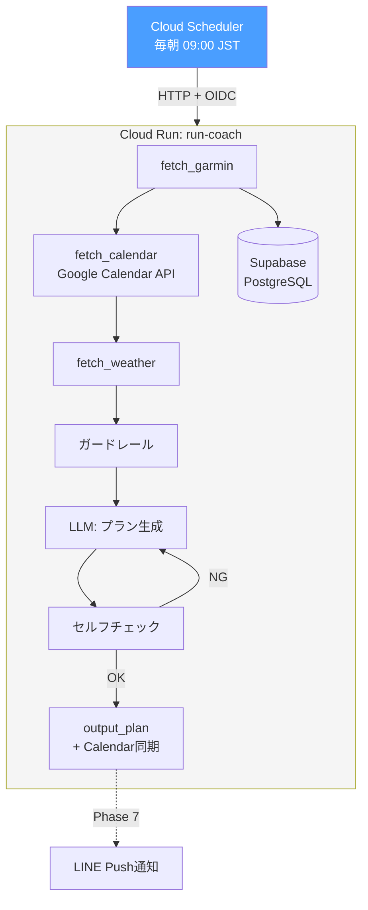

# Phase 6.3: Cloud Scheduler + 自動実行

Cloud Schedulerで毎朝プラン生成を自動実行する。

## ゴール

Macを閉じていても自動でプラン生成が動く状態にする。Phase 7（LINE通知）の前提基盤。

## 前提

- Phase 6.2 でCloud Run上にプラン生成API（`POST /coach`）がデプロイ済みであること

## フロー



## 構成

### サービスアカウント

| SA | 用途 |
|----|------|
| `run-coach-scheduler@run-coach-489511.iam.gserviceaccount.com` | Cloud Scheduler → Cloud Run OIDC認証用 |

### Cloud Schedulerジョブ

| 設定 | 値 |
|------|-----|
| ジョブ名 | `run-coach-daily` |
| スケジュール | `0 9 * * *`（毎朝 09:00 JST） |
| タイムゾーン | `Asia/Tokyo` |
| ターゲット | Cloud Runの `POST /coach` |
| 認証 | OIDC（`run-coach-scheduler` SA） |
| デッドライン | 300秒 |
| リトライ | 最大3回、30秒〜300秒バックオフ |

### アプリ側リトライ

- `tenacity` で LLM API呼び出しに最大3回・5秒間隔のリトライを追加
- 対象: `call_llm()` 関数（`run_coach/prompt.py`）
- Cloud Scheduler側のリトライはHTTPレスポンス不達時のフォールバック
- LLM APIのrate limit等の一時的エラーはアプリ側で吸収

## 実施したgcloudコマンド

```bash
# 1. SA作成
gcloud iam service-accounts create run-coach-scheduler \
  --display-name="run-coach Cloud Scheduler"

# 2. Cloud Run invoker権限を付与
gcloud run services add-iam-policy-binding run-coach \
  --region=asia-northeast1 \
  --member="serviceAccount:run-coach-scheduler@run-coach-489511.iam.gserviceaccount.com" \
  --role="roles/run.invoker"

# 3. Cloud Schedulerジョブ作成
CLOUD_RUN_URL=$(gcloud run services describe run-coach --region=asia-northeast1 --format='value(status.url)')

gcloud scheduler jobs create http run-coach-daily \
  --location=asia-northeast1 \
  --schedule="0 9 * * *" \
  --time-zone="Asia/Tokyo" \
  --uri="${CLOUD_RUN_URL}/coach" \
  --http-method=POST \
  --oidc-service-account-email=run-coach-scheduler@run-coach-489511.iam.gserviceaccount.com \
  --oidc-token-audience="${CLOUD_RUN_URL}" \
  --attempt-deadline=300s \
  --max-retry-attempts=3 \
  --min-backoff=30s \
  --max-backoff=300s
```

## Makefileコマンド

```bash
make scheduler-create   # ジョブ作成
make scheduler-delete   # ジョブ削除
make scheduler-run      # 手動実行（テスト用）
make scheduler-describe # 状態表示
```

## テスト方針

- [x] Cloud Scheduler → Cloud Run のE2Eテスト（`make scheduler-run`）
- [x] IAM認証が正しく機能すること（`--no-allow-unauthenticated` で担保済み）
- [x] リトライが正しく動作すること（`make scheduler-describe` で確認）
- [x] 既存テスト通過（`uv run pytest tests/`）
