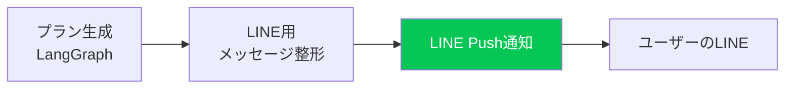
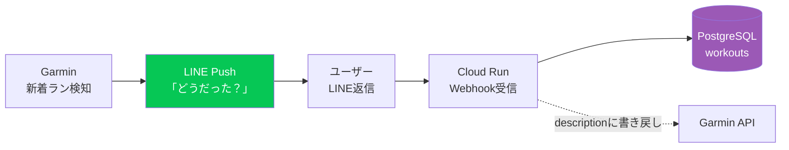

# Phase 7: LINE通知 + 振り返り対話

LINE Messaging APIで週次プラン配信と、ラン後の振り返り入力を実現する。

## ゴール

- 生成した週次プランをLINEで通知し、CLIを開かなくても結果を受け取れるようにする
- ラン後にLINEで振り返りを入力できるようにする（Garmin descriptionの補完）

## 前提

- Phase 5（PostgreSQL移行）が完了していること
- Phase 6（Cloud Run）が完了していること（Webhook受け口が必要）

## フロー

### プラン通知



### 振り返り対話



## やること

### LINE公式アカウント設定

- [ ] LINE公式アカウント作成
- [ ] Messaging API チャネル設定
- [ ] チャネルアクセストークン取得

### 実装

- [ ] LINE Messaging API クライアント (`run_coach/line.py`)
- [ ] プラン → LINEメッセージ変換 (`format_plan_for_line()`)
- [ ] Push通知送信 (`send_plan_notification()`)
- [ ] Webhook受信 → 振り返りをPostgreSQL保存 + Garmin書き戻し
- [ ] 環境変数: `RUN_COACH_LINE_CHANNEL_ACCESS_TOKEN`, `RUN_COACH_LINE_USER_ID`, `RUN_COACH_LINE_CHANNEL_SECRET`

## Cloud Scheduler（振り返りチェック）

Cloud Schedulerで `POST /check-new-activity` を定期実行し、新着ランを検知してLINEで振り返りプロンプトを自動送信する。

| 設定 | 値 |
|------|-----|
| ジョブ名 | `run-coach-check-activity` |
| スケジュール | `0 12-23 * * *`（毎日12時〜23時、毎時） |
| タイムゾーン | `Asia/Tokyo` |
| ターゲット | Cloud Runの `POST /internal/check-new-activity` |
| 認証 | OIDC（`run-coach-scheduler` SA） |
| デッドライン | 60秒 |
| リトライ | 最大2回、30秒〜120秒バックオフ |

### Makefileコマンド

```bash
make check-activity-run      # 手動実行（テスト用）
```

ジョブの作成・削除は `run-coach-infra` リポジトリ（Terraform）で管理する。

## メッセージ形式（案）

```
📋 今週のトレーニング計画
期間: 3/9(月) 〜 3/15(日)

3/9(月) イージーラン 40min
  → 疲労抜き / HR上限140
3/11(水) テンポ走 50min
  → 閾値向上 / 4:30/kmで20分
3/13(金) イージーラン 40min
  → 有酸素ベース / HR上限145
3/15(日) ロング走 90min
  → 持久力養成 / LSD 15km

💡 先週のロング走で心拍が高めだったため、
高強度を1回に抑えテンポ走に集中。
```

## テスト方針

- [ ] メッセージ変換: Plan JSON → LINE送信用テキストの変換が正しいか
- [ ] Push通知: API呼び出しが正しいパラメータで行われるか（モック）
- [ ] トークン未設定時: 適切なエラーメッセージを出すか

```python
def test_plan_to_line_message():
    plan = Plan(week_start="2026-03-09", workouts=[...], ...)
    message = format_plan_for_line(plan)
    assert "3/9" in message
    assert "イージーラン" in message

def test_send_notification_calls_api(mock_line_api):
    send_plan_notification(plan)
    mock_line_api.push_message.assert_called_once()
```
