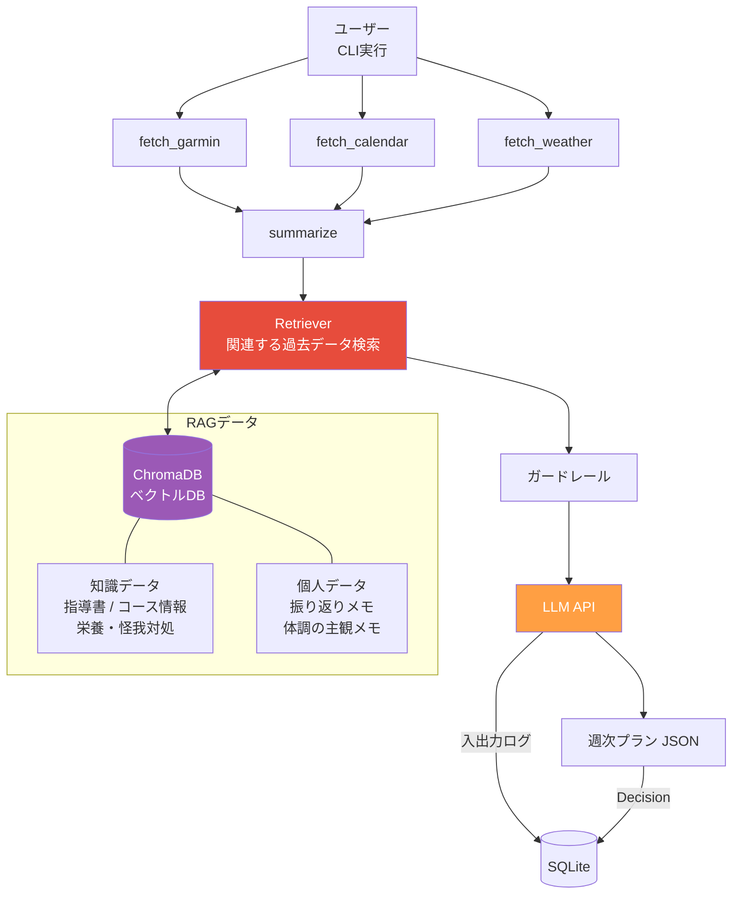

# Phase 7: RAG導入

ベクトル検索で自由文データ（振り返りメモ・指導書等）を活用する。

## ゴール

過去の振り返りやランニング知識を検索し、よりパーソナライズされたプランを生成する。

## フロー



## やること

- [ ] ChromaDB のセットアップ
- [ ] 埋め込みモデルの選定（OpenAI Embeddings等）
- [ ] Chunking戦略の設計（振り返りメモ / 指導書で分ける）
- [ ] Index設計（メタデータでフィルタリング可能にする）
- [ ] Retrieverの実装（クエリ→関連ドキュメント取得）
- [ ] 検索結果をLLMコンテキストに注入
- [ ] 検索結果のログ記録（参照IDを残す）

## RAGデータの分類

| 検索方法 | データ | 理由 |
|--|--|--|
| ベクトル検索 (ChromaDB) | レース振り返りメモ、体調の主観メモ、指導書の内容 | 自由文なので意味検索が有効 |
| 通常のDB検索 (SQLite) | ワークアウトログ、大会エントリー | 構造化データなので条件検索で十分 |

## 格納する知識データ

| カテゴリ | 内容 | 例 |
|--|--|--|
| コース情報 | 大会コースの特徴・高低差 | 「花巻ハーフは35km以降に上り」 |
| 栄養・補給戦略 | レース距離に応じた補給 | 「フルならジェルは30分おき」 |
| ランニング指導書 | メソッドの要約 | ダニエルズ、リディアード等 |
| 怪我の予防・対処 | 故障の兆候と対処法 | 「シンスプリントの初期対処」 |

## 格納する個人データ

| カテゴリ | 内容 | 例 |
|--|--|--|
| レース振り返り | レース後の感想・反省 | 「後半ペースが落ちた。LSD不足」 |
| 体調メモ | 主観的な体調記録 | 「脚が重い」「調子良い」 |
| 仕事の繁忙期 | 忙しい時期のパターン | 「毎年3月は忙しい」 |

## テスト方針

- [ ] ドキュメント登録: ChromaDBにチャンクが正しく保存されるか
- [ ] 検索精度: 意味的に関連するドキュメントがヒットするか
- [ ] メタデータフィルタ: カテゴリ・日付で絞り込めるか
- [ ] 検索結果のログ: 参照IDがllm_callsと紐付けて記録されるか
- [ ] チャンク分割: 長文が適切なサイズに分割されるか

```python
# テスト例
def test_retrieve_related_memo(vector_db):
    # 振り返りメモを登録
    add_document(vector_db, "30km走で25km以降に脚が重くなった。ペース維持できず。",
                 metadata={"type": "review", "date": "2026-02-15"})
    add_document(vector_db, "今日はジョグ。体が軽くて調子良い。",
                 metadata={"type": "review", "date": "2026-02-16"})

    # 検索
    results = retrieve(vector_db, "ロング走で後半バテる")
    assert "25km以降に脚が重くなった" in results[0]["text"]

def test_metadata_filter(vector_db):
    add_document(vector_db, "膝に違和感", metadata={"type": "pain"})
    add_document(vector_db, "好調", metadata={"type": "review"})

    results = retrieve(vector_db, "膝", filter={"type": "pain"})
    assert len(results) == 1
```

## State（追加分）

```python
class AgentState(BaseModel):
    user_profile: UserProfile
    signals: Signals
    constraints: Constraints
    memory: dict | None = None      # ← Phase 7で追加（RAG検索結果）
    plan: Plan | None = None
    logs: list[dict] | None = None
```
